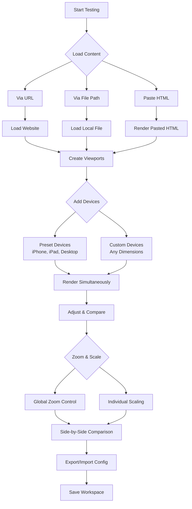
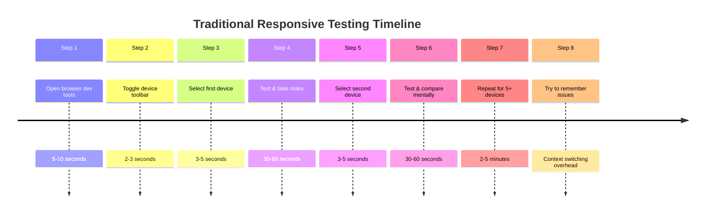
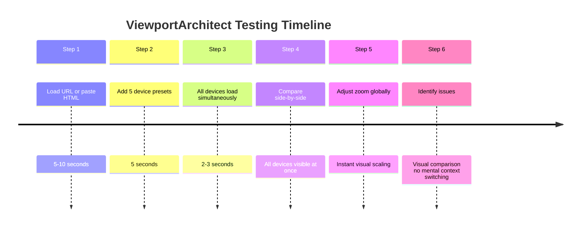
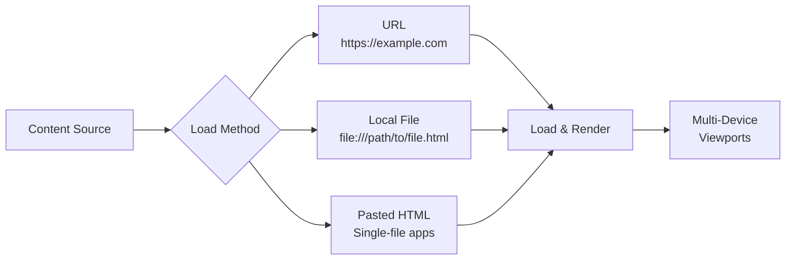
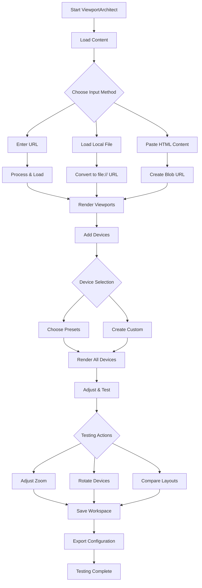
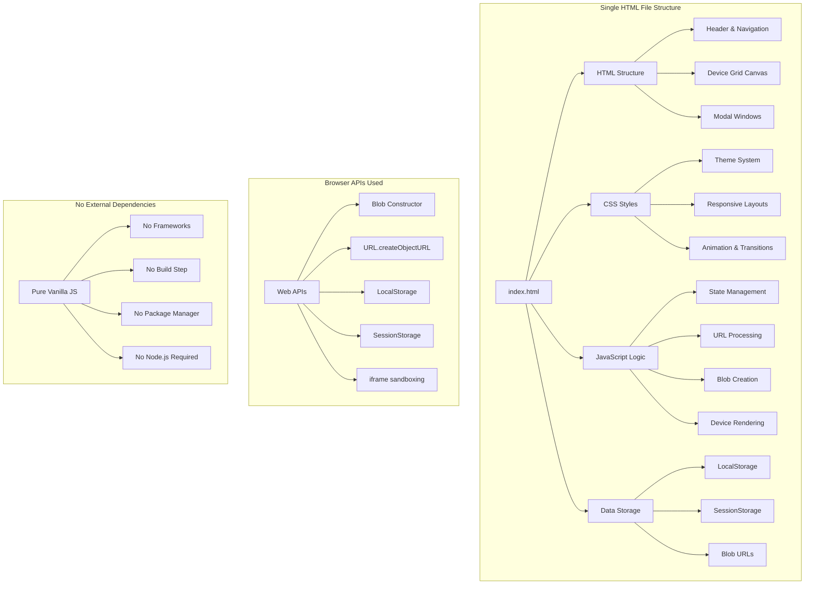
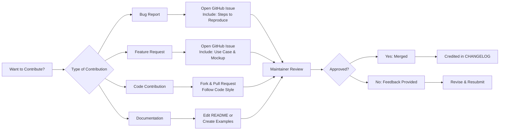

# ViewportArchitect 🌐📱💻

<div align="center">

[](https://github.com/Aliriyaj007/ViewportArchitect/stargazers)
[](https://github.com/Aliriyaj007/ViewportArchitect/network/members)
[](LICENSE)
[](https://opensource.org)
[](https://github.com/Aliriyaj007/ViewportArchitect)

**Test responsive designs across multiple devices simultaneously without browser resizing**

[🌐 **Live Demo**](https://aliriyaj007.github.io/ViewportArchitect/)
[📥 **Direct Download**](#-installation)
[📖 **How It Works**](#-how-it-works)
[⚡ **Quick Start**](#-quick-start-guide)

</div>

## 📋 Table of Contents
- [🎯 Overview](#-overview)
- [🤔 Why ViewportArchitect?](#-why-viewportarchitect)
- [🔄 Before vs After](#-before-vs-after)
- [⚡ Quick Start Guide](#-quick-start-guide)
- [✨ Key Features](#-key-features)
- [🚀 Installation](#-installation)
- [📖 Usage Guide](#-usage-guide)
- [🔧 Technical Architecture](#-technical-architecture)
- [🤝 Contributing](#-contributing)
- [👨💻 Author](#-author)
- [📄 License](#-license)

## 🎯 Overview

**ViewportArchitect** is a professional-grade responsive design testing tool that enables developers to visualize web applications across multiple device viewports simultaneously. Unlike traditional browser resizing or device emulation, this tool provides a unified workspace where you can test, compare, and iterate on responsive designs in real-time.

Built as a single, self-contained HTML file, ViewportArchitect eliminates dependency hell, installation complexity, and version conflicts. It works anywhere a modern browser runs—locally, on a server, or even offline.

## 🤔 Why ViewportArchitect?

### The Problem
Testing responsive designs traditionally requires:
- Constantly resizing browser windows
- Switching between browser dev tools tabs
- Using multiple physical devices
- Remembering specific viewport dimensions
- Manually testing at various zoom levels
- Losing context when switching between views

### The Solution
ViewportArchitect consolidates the entire responsive testing workflow into a single, intuitive interface:



### Real-World Impact

| Scenario | Without ViewportArchitect | With ViewportArchitect |
|----------|---------------------------|------------------------|
| Testing a new component | Open 5 browser windows, manually resize each, lose track of which is which | Add 5 device presets, see all simultaneously, immediately spot inconsistencies |
| Client review session | Share screenshots or send multiple device screenshots | Share a single workspace showing the exact same view across all target devices |
| Local development | Constantly toggle between responsive modes in dev tools | Keep all viewports visible while coding, see changes in real-time |
| QA testing | Write down issues per device, manually switch devices | Document issues directly in context, with all devices visible for comparison |

## 🔄 Before vs After

### ❌ Before: The Traditional Workflow



**Total time: 5-10 minutes, with high cognitive load and mental context switching**

### ✅ After: The ViewportArchitect Workflow



**Total time: 15-20 seconds, with zero context switching and immediate visual comparison**

## ⚡ Quick Start Guide

### Method 1: Use the Hosted Version (60 seconds)
1. **Visit** [aliriyaj007.github.io/ViewportArchitect](https://aliriyaj007.github.io/ViewportArchitect)
2. **Enter** a URL in the address bar (or click "Paste HTML" for local content)
3. **Add** devices from the sidebar (click any preset)
4. **Adjust** zoom with the slider
5. **You're testing!** All devices update in real-time

### Method 2: Run Locally (30 seconds)
```bash
# Download the single HTML file
curl -O https://raw.githubusercontent.com/Aliriyaj007/ViewportArchitect/main/index.html

# Open in browser
open index.html  # Mac
start index.html # Windows
xdg-open index.html # Linux
```

### Method 3: Bookmark for Instant Access
Create a bookmark with this URL:
```
data:text/html;base64,PCFET0NUWVBFIGh0bWw+DQo8aHRtbCBsYW5nPSJlbiI+DQo8aGVhZD4NCiAgICA8bWV0YSBjaGFyc2V0PSJVVEYtOCI+DQogICAgPG1ldGEgbmFtZT0idmlld3BvcnQiIGNvbnRlbnQ9IndpZHRoPWRldmljZS13aWR0aCwgaW5pdGlhbC1zY2FsZT0xLjAiPg0KICAgIDx0aXRsZT5WaWV3cG9ydEFyY2hpdGVjdCB8IFJlc3BvbnNpdmUgRGV2ZWxvcG1lbnQgV29ya3NwYWNlPC90aXRsZT4NCiAgICA8bWV0YSBodHRwLWVxdWl2PSJyZWZyZXNoIiBjb250ZW50PSIwO1VSTD1odHRwczovL2FsaXJpeWFqMDA3LmdpdGh1Yi5pby9WaWV3cG9ydEFyY2hpdGVjdCI+DQo8L2hlYWQ+DQo8Ym9keT4NCiAgICA8ZGl2IHN0eWxlPSJwb3NpdGlvbjogZml4ZWQ7IHRvcDogNTAlOyBsZWZ0OiA1MCU7IHRyYW5zZm9ybTogdHJhbnNsYXRlKC01MCUsIC01MCUpOyB0ZXh0LWFsaWduOiBjZW50ZXI7IHBhZGRpbmc6IDIwcHg7IGJhY2tncm91bmQ6IHdoaXRlOyBib3JkZXItcmFkaXVzOiAxMHB4OyBib3gtc2hhZG93OiAwIDAgMjBweCByZ2JhKDAsMCwwLDAuMSk7Ij4NCiAgICAgICAgPGgxPkxvYWRpbmcgVmlld3BvcnRBcmNoaXRlY3QuLi48L2gxPg0KICAgICAgICA8cD5SZWRpcmVjdGluZyB0byB0aGUgYXBwbGljYXRpb24uLi48L3A+DQogICAgPC9kaXY+DQo8L2JvZHk+DQo8L2h0bWw+
```

## ✨ Key Features

### 🎨 **Multi-Theme Interface**
Choose from 8 professionally designed themes optimized for different lighting conditions and personal preferences:

| Theme | Best For | Primary Color |
|-------|----------|---------------|
| Midnight (Default) | Low-light coding sessions | `#3b82f6` |
| Cyberpunk | High-contrast visibility | `#f0f` |
| Solarized | Eye strain reduction | `#d33682` |
| Deep Ocean | Extended focus sessions | `#06b6d4` |
| Forest | Natural lighting environments | `#48bb78` |
| Sunset | Evening/night work | `#ff5722` |
| Royal | High-visibility needs | `#d6bcfa` |
| Monochrome | Print/screenshot workflows | `#000000` |

### 📱 **Comprehensive Device Library**
Built-in presets for the most common devices, with accurate viewport dimensions:

| Device Category | Presets Included | Common Use Cases |
|-----------------|------------------|------------------|
| Mobile | iPhone SE, iPhone 14, Pixel 7 | Mobile-first design, PWA testing |
| Tablet | iPad Mini, iPad Pro | Hybrid app testing, responsive tables |
| Desktop | Laptop (1366×768), Full HD (1920×1080) | Web application testing, dashboard layouts |

### 🔄 **Dynamic Content Loading**
Three methods to load your web content:



### ⚙️ **Advanced Controls**
| Control | Function | Shortcut/Default |
|---------|----------|------------------|
| Global Zoom | Scale all viewports simultaneously | Slider (20-150%) |
| Device Rotation | Test landscape/portrait orientations | ↻ Button |
| Custom Devices | Add any viewport dimension | Width × Height inputs |
| Workspace Management | Save/load configurations | Import/Export JSON |

### 📊 **Visual Comparison Matrix**
| Feature | ViewportArchitect | Chrome DevTools | BrowserStack | LambdaTest |
|---------|-------------------|-----------------|--------------|------------|
| Simultaneous viewports | ✅ Multiple | ❌ Single | ✅ Paid tier | ✅ Paid tier |
| No installation | ✅ Single HTML | ❌ Browser-only | ❌ Account required | ❌ Account required |
| Local file support | ✅ Direct & Paste | ⚠️ Limited | ❌ No | ❌ No |
| Offline capability | ✅ Full | ❌ No | ❌ No | ❌ No |
| Custom viewports | ✅ Unlimited | ✅ Limited | ✅ Paid tier | ✅ Paid tier |
| Cost | Free & Open Source | Free | $29+/month | $15+/month |

## 🚀 Installation

### Option 1: Direct Download (Recommended)
```bash
# Download the single HTML file
wget https://raw.githubusercontent.com/Aliriyaj007/ViewportArchitect/main/index.html -O ViewportArchitect.html

# Or use curl
curl -L https://raw.githubusercontent.com/Aliriyaj007/ViewportArchitect/main/index.html -o ViewportArchitect.html

# Open it
open ViewportArchitect.html
```

### Option 2: Clone Repository
```bash
# Clone the repository
git clone https://github.com/Aliriyaj007/ViewportArchitect.git

# Navigate to directory
cd ViewportArchitect

# Open the application
open index.html
```

### Option 3: GitHub Pages (No Download)
Simply visit:  
**[https://aliriyaj007.github.io/ViewportArchitect/](https://aliriyaj007.github.io/ViewportArchitect/)**

### Option 4: Browser Bookmarklet
Create a new bookmark with this URL:
```javascript
javascript:(function(){window.open('https://aliriyaj007.github.io/ViewportArchitect/?url='+encodeURIComponent(window.location.href),'_blank','width=1400,height=900');})();
```
Clicking this bookmarklet while on any website will open it in ViewportArchitect.

## 📖 Usage Guide

### Basic Workflow



### Step-by-Step Tutorial

#### 1. **Loading Your Content**
**Method A: Website URL**
```bash
# Example URLs that work:
https://example.com
http://localhost:3000
192.168.1.100:8080
```

**Method B: Local HTML File**
```bash
# Direct file paths (auto-converted to file:// URLs):
C:\Users\You\project\index.html
/Users/You/Sites/project/index.html
./relative/path/to/file.html
```

**Method C: Paste HTML Content**
1. Click "Paste HTML" button
2. Paste your complete HTML file (with `<html>`, `<head>`, `<body>` tags)
3. Click "Load HTML"
4. Works with single-file web apps containing inline CSS/JS

#### 2. **Adding Devices**

**Preset Devices Table:**
| Device | Width | Height | Use Case |
|--------|-------|--------|----------|
| iPhone SE | 375px | 667px | Small mobile testing |
| iPhone 14 | 393px | 852px | Modern mobile |
| Pixel 7 | 412px | 915px | Android testing |
| iPad Mini | 768px | 1024px | Tablet portrait |
| iPad Pro | 1024px | 1366px | Tablet landscape |
| Laptop | 1366px | 768px | Small desktop |
| Desktop | 1920px | 1080px | Full HD testing |

**Custom Devices:**
```javascript
// Common custom dimensions:
{ name: "Apple Watch", width: 394, height: 324 }
{ name: "Surface Duo", width: 540, height: 720 }
{ name: "UltraWide", width: 2560, height: 1080 }
{ name: "4K Monitor", width: 3840, height: 2160 }
```

#### 3. **Advanced Features**

**Global Zoom Control:**
```javascript
// Keyboard shortcuts for zoom (when slider is focused):
Arrow Left/Right: Adjust in 10% increments
Home: Reset to 100%
End: Set to minimum (20%)
Page Up/Down: Adjust in 25% increments
```

**Workspace Management:**
```json
// Example exported configuration:
{
  "url": "blob:https://viewportarchitect...",
  "globalScale": 0.7,
  "theme": "forest",
  "activeDevices": [
    { "id": "d1", "name": "iPhone 14", "width": 393, "height": 852 },
    { "id": "d2", "name": "iPad Mini", "width": 768, "height": 1024 },
    { "id": "d3", "name": "Custom Tablet", "width": 900, "height": 1200 }
  ]
}
```

### Practical Examples

#### Example 1: Testing a Landing Page
```bash
# Load your landing page
URL: https://your-landing-page.com

# Add these devices:
1. iPhone 14 (393×852)
2. iPad Mini (768×1024) 
3. Desktop (1920×1080)

# Set zoom to 70% for side-by-side comparison
# Test call-to-action buttons on all devices
```

#### Example 2: Local Development
```bash
# Load local development server
URL: http://localhost:3000

# Add devices for your target audience:
1. iPhone SE (smallest supported)
2. Pixel 7 (mid-range Android)
3. iPad Pro (tablet experience)
4. Laptop (1366×768 - most common)

# Keep ViewportArchitect open while coding
# See real-time changes across all devices
```

#### Example 3: Client Presentation
```bash
# Paste the HTML of the proposed design
Click "Paste HTML" > Paste complete HTML > Load

# Add client's requested devices:
1. iPhone 14 Pro (client's phone)
2. iPad Air (client's tablet)
3. 27" iMac (client's office computer)

# Use "Royal" theme for high visibility
# Export configuration to share with client
```

## 🔧 Technical Architecture

### Single-File Design Philosophy



### Core Technologies
| Technology | Purpose | Implementation |
|------------|---------|----------------|
| HTML5 | Application structure | Semantic elements, iframes |
| CSS3 | Styling and themes | CSS variables, Grid, Flexbox |
| JavaScript ES6+ | Application logic | Modules, LocalStorage, Blob API |
| Browser APIs | Advanced features | iframe sandboxing, Object URLs |
| LocalStorage | Configuration persistence | Workspace saving/loading |

### Performance Characteristics
| Metric | Value | Notes |
|--------|-------|-------|
| File Size | ~45KB (uncompressed) | Single HTML file |
| Load Time | < 2 seconds | On modern broadband |
| Memory Usage | ~50MB per viewport | Depends on content complexity |
| Maximum Devices | Limited by system memory | Typically 8-12 simultaneous |
| Cross-browser | Chrome, Firefox, Safari, Edge | Modern browsers only |

### Security Considerations
| Feature | Security Implementation | Purpose |
|---------|-------------------------|---------|
| iframe Sandboxing | `sandbox="allow-scripts allow-same-origin allow-forms"` | Isolate content |
| Blob URL Content | Same-origin policy applies | Prevent XSS |
| Local File Access | User-initiated only | Security restrictions |
| No Server Communication | Entirely client-side | Privacy by design |

## 🤝 Contributing

ViewportArchitect is open source and welcomes contributions. The project follows a pragmatic, utility-first approach.

### Contribution Guidelines



### Development Setup
```bash
# 1. Fork the repository
# Click "Fork" on GitHub

# 2. Clone your fork
git clone https://github.com/YourUsername/ViewportArchitect.git
cd ViewportArchitect

# 3. That's it. No build step, no dependencies.
# Open index.html in your browser and start coding.
```

### Project Structure
```
ViewportArchitect/
├── index.html              # The entire application
├── README.md              # This documentation
├── LICENSE               # MIT License
└── .github/              # GitHub templates
    ├── ISSUE_TEMPLATE/
    │   ├── bug_report.md
    │   └── feature_request.md
    └── workflows/
        └── deploy.yml    # GitHub Pages deployment
```

### Code Style
- **Indentation**: 4 spaces (no tabs)
- **CSS**: BEM-like naming convention
- **JavaScript**: ES6+ with descriptive variable names
- **Comments**: Explain "why" not "what"
- **File Organization**: HTML → CSS → JS (within single file)

### Areas Needing Contribution
1. **Additional Device Presets**: Industry-standard devices
2. **Theme Development**: New color schemes
3. **Accessibility Improvements**: Better keyboard navigation
4. **Export Features**: Screenshot functionality
5. **Integration Examples**: Usage with popular frameworks

## 👨💻 Author

**Riyajul Ali**  
Professional developer focused on creating practical, no-nonsense tools that solve real problems.

| Contact Method | Link | Response Time |
|----------------|------|---------------|
| GitHub | [Aliriyaj007](https://github.com/Aliriyaj007) | 24-48 hours |
| Email | [aliriyaj007@protonmail.com](mailto:aliriyaj007@protonmail.com) | 48 hours |
| LinkedIn | [Aliriyaj007](https://linkedin.com/in/Aliriyaj007) | 72 hours |
| Project Issues | [GitHub Issues](https://github.com/Aliriyaj007/ViewportArchitect/issues) | 24 hours |

### Other Projects
- **[CSS Grid Generator](https://github.com/Aliriyaj007/CSS-Grid-Generator)** - Visual CSS Grid builder
- **[JSON Viewer Pro](https://github.com/Aliriyaj007/JSON-Viewer-Pro)** - Advanced JSON visualization
- **[Markdown Previewer](https://github.com/Aliriyaj007/Markdown-Previewer)** - Live markdown editing

## 📄 License

MIT License

```
Copyright (c) 2024 Riyajul Ali

Permission is hereby granted, free of charge, to any person obtaining a copy
of this software and associated documentation files (the "Software"), to deal
in the Software without restriction, including without limitation the rights
to use, copy, modify, merge, publish, distribute, sublicense, and/or sell
copies of the Software, and to permit persons to whom the Software is
furnished to do so, subject to the following conditions:

The above copyright notice and this permission notice shall be included in all
copies or substantial portions of the Software.

THE SOFTWARE IS PROVIDED "AS IS", WITHOUT WARRANTY OF ANY KIND, EXPRESS OR
IMPLIED, INCLUDING BUT NOT LIMITED TO THE WARRANTIES OF MERCHANTABILITY,
FITNESS FOR A PARTICULAR PURPOSE AND NONINFRINGEMENT. IN NO EVENT SHALL THE
AUTHORS OR COPYRIGHT HOLDERS BE LIABLE FOR ANY CLAIM, DAMAGES OR OTHER
LIABILITY, WHETHER IN AN ACTION OF CONTRACT, TORT OR OTHERWISE, ARISING FROM,
OUT OF OR IN CONNECTION WITH THE SOFTWARE OR THE USE OR OTHER DEALINGS IN THE
SOFTWARE.
```

---

<div align="center">

**ViewportArchitect**  
*See everything. Test everywhere. Build with confidence.*

[](https://github.com/Aliriyaj007/ViewportArchitect)
[](https://aliriyaj007.github.io/ViewportArchitect/)
[](#-installation)

*Last Updated: March 2024*

</div>
